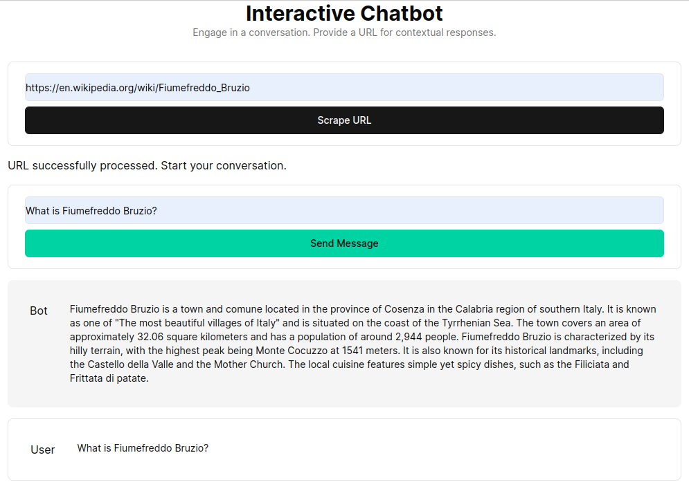

# Next.js + FastAPI: Chat with Your Website

This application facilitates a chatbot by leveraging Next.js as the frontend and FastAPI as the backend, utilizing the power of LangChain for dynamic web interactions.



## Features of the Hybrid App

- **Web Interaction via LangChain**: Utilizes the latest LangChain version for effective interaction and information extraction from websites.
- **Versatile Language Model Integration**: Offers compatibility with various models including GPT-4. Users can easily switch between models to suit their needs.
- **User-Friendly Next.js Frontend**: The interface is intuitive and accessible for users of all technical backgrounds.

## Operational Mechanics

The application integrates the Python/FastAPI server into the Next.js app under the `/api/` route. This is achieved through [`next.config.js` rewrites](https://github.com/digitros/nextjs-fastapi/blob/main/next.config.js), directing any `/api/:path*` requests to the FastAPI server located in the `/api` folder. Locally, FastAPI runs on `127.0.0.1:8000`, while in production, it operates as serverless functions on Vercel.

## Setting Up the Application

1. Install dependencies:
   ```bash
   npm install
   ```
2. Create a `.env` file with your OpenAI API key:
   ```
   OPENAI_API_KEY=[your-openai-api-key]
   ```
3. Start the development server:
   ```bash
   npm run dev
   ```
4. Access the application at [http://localhost:3000](http://localhost:3000). The FastAPI server runs on [http://127.0.0.1:8000](http://127.0.0.1:8000).

For backend-only testing:

```bash
conda create --name nextjs-fastapi-your-chat python=3.10
conda activate nextjs-fastapi-your-chat
pip install -r requirements.txt
uvicorn api.index:app --reload
```

## Maintaining Chat History (TODO List)

Options for preserving chat history include:

- **Global Variable**: Simple but not ideal for scalability and consistency.
- **In-Memory Database/Cache**: Scalable solutions like Redis for storing chat history.
- **Database Storage**: Robust and persistent method, suitable for production environments.

## Understanding RAG Algorithms

RAG (Retrieval Augmented Generation) enhances language models with context retrieved from a custom knowledge base. The process involves fetching HTML documents, splitting them into chunks, and vectorizing these chunks using embedding models like OpenAI's. This vectorized data forms a vector store, enabling semantic searches based on user queries. The retrieved relevant chunks are then used as context for the language model, forming a comprehensive response to user inquiries.

## Implementing Context Retrieval

The `get_vectorstore_from_url` function extracts and processes text from a given URL, while `get_context_retriever_chain` forms a chain that retrieves context relevant to the entire conversation history. This pipeline approach ensures that responses are contextually aware and accurate.

## Inspiration and References

- [chat-with-websites](https://github.com/alejandro-ao/chat-with-websites)
- [next13-ai-saas](https://github.com/AntonioErdeljac/next13-ai-saas)
